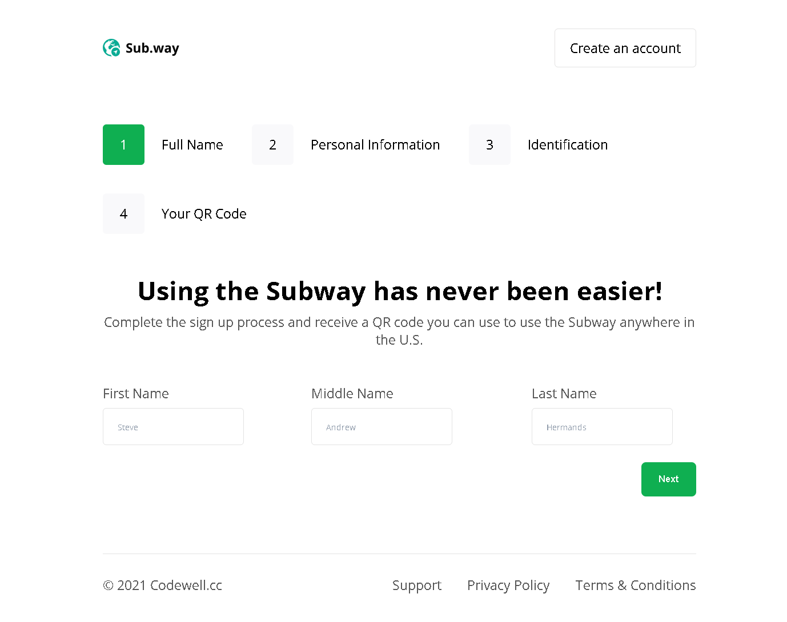
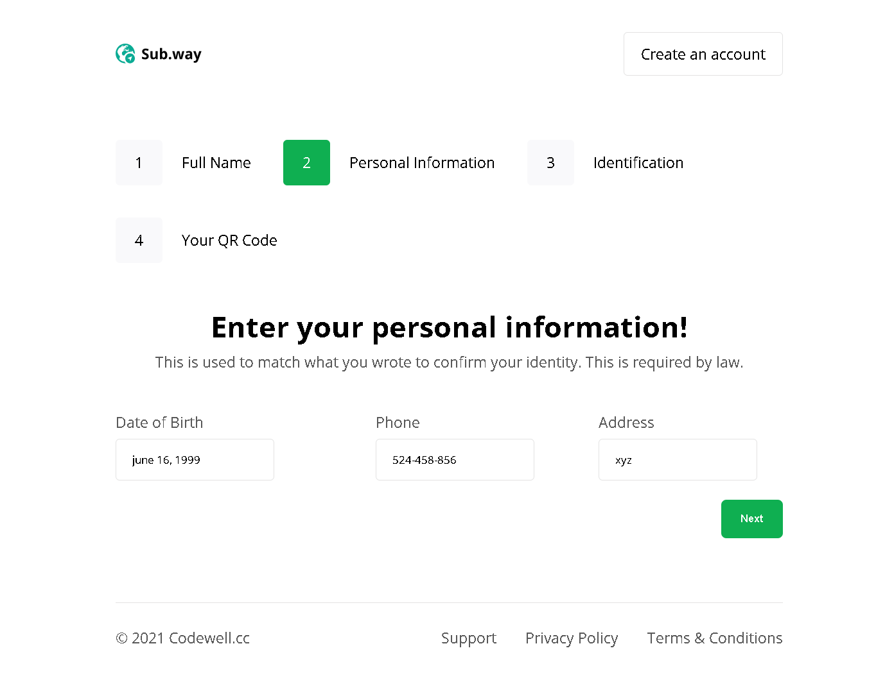
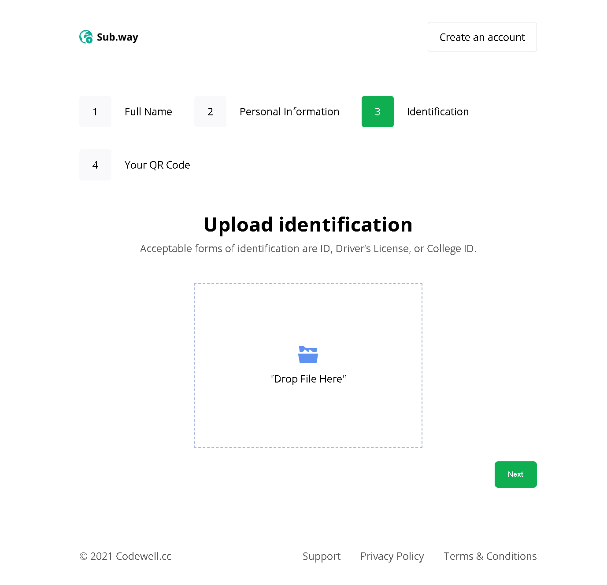
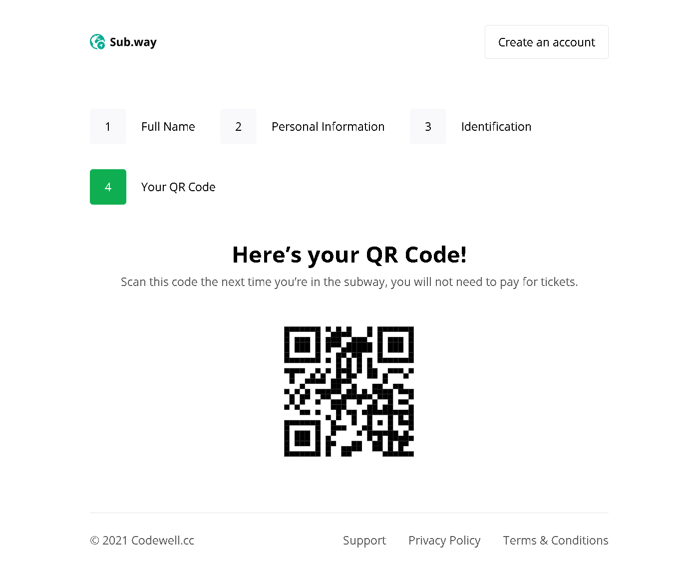

# MULTISTEP FORM - Subway Sign-Up Form

A multi-step sign-up form for subway users, allowing them to create an account, submit personal information, upload identification, and generate a QR code for subway access.

## Table of contents

- [Overview](#overview)
  - [Screenshot](#screenshot)
  - [Links](#links)
- [My process](#my-process)
  - [Built with](#built-with)
  - [What I learned](#what-i-learned)
  - [Continued development](#continued-development)
- [Author](#author)
- [Acknowledgments](#acknowledgments)


## Overview

This is a simple weather application that allows users to search for the current weather of any city. It uses the [OpenWeatherMap API](https://openweathermap.org/api) to fetch the weather details and displays information such as temperature, weather description, and min/max temperatures.


### Screenshot

- **MULTISTEP FORM : STEP1**



- **MULTISTEP FORM : STEP2**



- **MULTISTEP FORM : STEP3**



- **MULTISTEP FORM : STEP4**




### Links

- Solution URL: [https://github.com/hoor23/MultiStep_Form.git](https://github.com/hoor23/MultiStep_Form.git)
- Live Site URL: [ https://hoor23.github.io/MultiStep_Form/]( https://hoor23.github.io/MultiStep_Form/)

## My process

### Built with

- HTML5 : for the structure of the webpage
- CSS3 : for styling and layout, including media queries for responsive design
- JavaScript (ES6): for managing form steps and handling the file upload system
- Google Fonts : for typography (Open Sans font)
- Responsive design : to ensure usability on various screen sizes

### What I learned

While building this project, I deepened my understanding of:
- Creating multi-step forms with step indicators using JavaScript.
- Handling drag-and-drop file uploads with `dragover`, `dragleave`, and `drop` events.
- Using JavaScript to dynamically manage form progress and interactivity, such as adding and removing CSS classes based on user actions.


This snippet demonstrates how I managed the multi-step form logic:

```javascript
let index = 0;

nextBtn.addEventListener("click", handleNext);

function handleNext(event) {
  index++;
  
  if (index === 3) {
    nextBtn.style.display = "none";
  }

  document.querySelector(".count.active").classList.remove("active");
  stepinfo[index].classList.add("active");

  document.querySelector(".steps.active").classList.remove("active");
  steps[index].classList.add("active");
}
```

This section of code dynamically updates the active step in the form when the user clicks the "Next" button.

### Continued development

For future iterations of the project, I plan to:

- Add form validation to ensure all fields are filled in correctly before moving to the next step.
- Improve the UI/UX with more visually appealing animations and transitions between steps.
- Implement a backend service to store user data and handle QR code generation.

## Author
- Frontend Mentor - [hoor23](https://www.frontendmentor.io/profile/hoor23)
- Github - [hoor23](https://github.com/hoor23)
- LinkedIn - [Hoor Seyda](www.linkedin.com/in/hoor-seyda-901176222)

## Acknowledgments

- Thanks to Codewell for the design inspiration.
